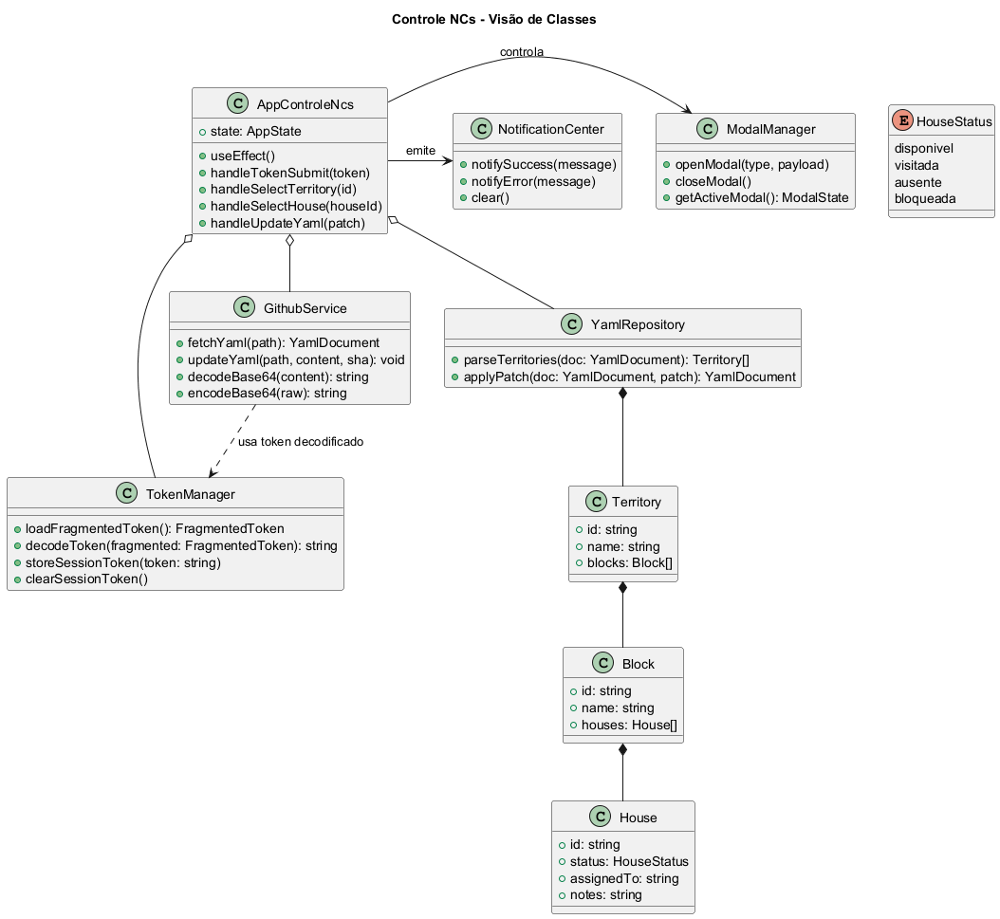
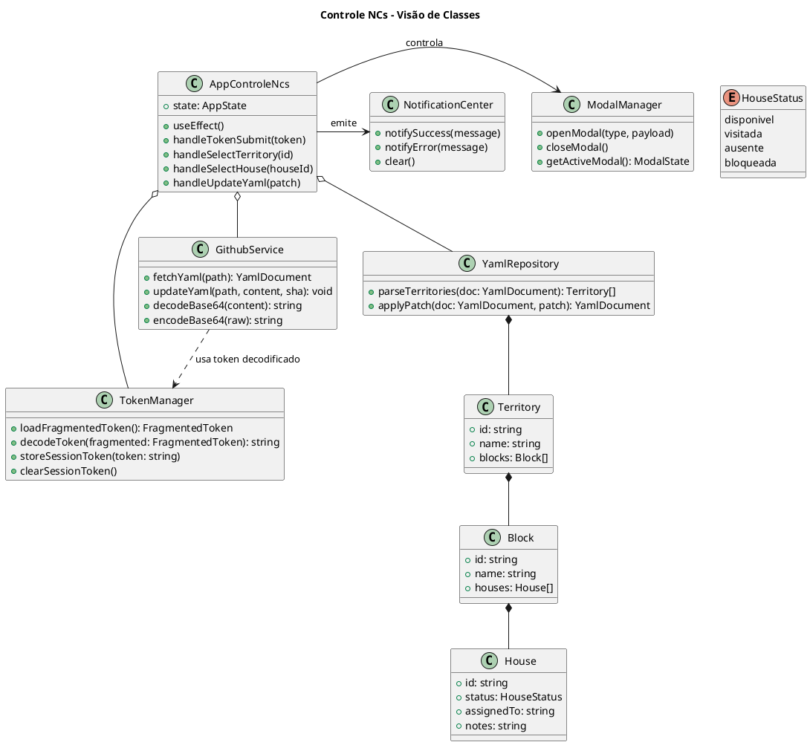

# 🌐 Construindo um Aplicativo com um Agente-Desenvolvedor  
### Uma experiência pessoal com o GPT-5 Codex  
**Por Moshe**

---

## 🧭 Sumário e Intenção
Este documento revisado narra a coautoria entre humano e agente sintetizando: objetivos, processo técnico, resultados e aprendizados. O leitor encontrará descrição detalhada do app Controle NCs, narrativas situacionais, glossário e análise de código (incluindo os arquivos YAML que servem de banco de dados).

## 🗂 Organização do Documento
- Seção 1 — Contexto e motivação.  
- Seção 2 — Cronologia completa da colaboração.  
- Seção 3 — Arquitetura, tecnologias e fluxos.  
- Seção 4 — Codebase comentada (React, scripts e YAML).  
- Seção 5 — Interação humano-IA e dinâmica operacional.  
- Seção 6 — Resultados, métricas e validações.  
- Seção 7 — Lições, próximos passos e recomendações.  
- Anexos — Glossário, referências e roteiros complementares.

---

## 1. 🎬 Introdução e Contexto
Tudo começou com uma pergunta orientadora: **até onde uma inteligência artificial pode realmente construir um sistema funcional em parceria com um humano?**

O desafio deu origem ao **app Controle NCs**, uma aplicação React para gerir notificações de contato em territórios de serviço de campo. Escolhemos trabalhar em coautoria: eu, responsável por intenção e direção; o agente GPT-5 Codex, responsável por execução, diagnóstico e publicação dentro do VS Code.

---

## 2. 🗓 Cronologia da Colaboração
1. **Diagnóstico inicial** — inspeção do repositório, identificação de dependências, estrutura YAML e rotinas de build/deploy.  
2. **Correção de erros 404** — rastreamento do problema até caminhos incorretos de arquivos; reorganização de `data/db.yml` e atualização de references na aplicação.  
3. **Refino do fluxo PAT** — implementação de novos estados em `AppControleNcs.tsx`, validações, feedback visual e scripts dedicados (`publish-token.mjs`).  
4. **Automação de deploy** — ajuste do workflow `pages.yml`, remoção de pipelines conflitantes, verificação de `npm run build` e `npm run preview`.  
5. **Testes end-to-end** — revisão do teste Playwright `tests/pat-flow.spec.ts`, execução e geração de relatórios em `test-results/`.  
6. **Produção documental** — criação de guias, FAQ, checklists e compêndio histórico (`docs_export/`).  
7. **Empacotamento final** — preparação de artefatos zipados, validação manual e roteiros de continuidade.

---

## 3. 🏗 Arquitetura, Tecnologias e Ambiente
**Stack principal**
- React + Vite para front-end SPA e build rápido.  
- Tailwind CSS para estilização utilitária.  
- Playwright para testes end-to-end.  
- GitHub Pages para hospedagem estática.  
- GitHub REST API para leitura e escrita de dados versionados.

**Scripts e automação**
- `scripts/publish-token.mjs`: ofusca o PAT e gera `public/token.json`.  
- `scripts/validate-token-flow.mjs`: valida integridade do token (execução manual opcional).  
- Workflow `pages.yml`: instala dependências, constrói `docs/` e publica em `gh-pages`.

**Ambiente de trabalho**
- VS Code com Copilot Chat e terminal PowerShell.  
- GPT-5 Codex operando como agente com acesso ao workspace, comandos (`npm`, `git`, `build`) e edição de arquivos.

---

## 4. 🧾 Codebase e Banco de Dados Comentados
### 4.1 Aplicação React (pasta `src/`)
- `App.tsx`: exporta o componente raiz que invoca `AppControleNcs`.  
- `AppControleNcs.tsx`: coração do app; gerencia estados (`loading`, `error`, seleção de território/casa), modais, notificações e chamadas à API do GitHub.  
- `main.tsx`: ponto de entrada Vite que monta a aplicação em `#root`.  
- `index.css`: importa diretivas Tailwind e define tipografia.  
- `types/js-yaml.d.ts`: complementa tipagem para o parser YAML utilizado no front-end.

### 4.2 Dados em YAML (`data/db.yml`)
O arquivo `data/db.yml` funciona como **banco de dados versionado**. A estrutura típica contém:
```yaml
appConfig:
	superAdmins:
		- nome: "Admin"
			contato: "admin@example.com"
	roles:
		- name: "Coordenador"
			permissions:
				- allocateTerritory
territories:
	- id: "T-001"
		name: "Território Piloto"
		blocks:
			- id: "Q-01"
				houses:
					- id: "Casa-1"
						status: "visitada"
						assignedTo: "Equipe A"
```
**Objetivos do YAML**
- Servir como fonte única de verdade (Single Source of Truth).  
- Permitir versionamento, rollback e auditoria via Git.  
- Descrever hierarquia de territórios, quadras e casas com responsáveis, status e metadados adicionais.

**Manipulação pelo app**
- A aplicação lê `data/db.yml` por meio da API `repos/:owner/:repo/contents/`.  
- O conteúdo base64 é parseado com `js-yaml`.  
- Alterações (ex.: status de uma casa) geram um PUT que inclui `sha` atual do arquivo.  
- Sucesso é sinalizado com notificações visuais; falhas exibem mensagens detalhadas.

### 4.3 Token ofuscado (`public/token.json` / `docs/token.json`)
Esses arquivos guardam fragmentos codificados do PAT em JSON, incluindo `payload`, `fragmentSize`, `charSet` e `checksum`. O objetivo é distribuir um token reconstruível apenas por quem conhece o processo, reduzindo exposição direta em texto plano.

### 4.4 Scripts auxiliares (`scripts/`)
- `publish-token.mjs`: solicita PAT, ofusca e comita o JSON atualizado.  
- `validate-token-flow.mjs`: (quando utilizado) verifica se o payload ofuscado remonta a um valor válido antes da publicação.  
- Automação presume execução com `node` e, quando possível, uso de variável `GITHUB_TOKEN` temporária.

### 4.5 Testes (`tests/pat-flow.spec.ts`)
O teste Playwright garante regressão mínima: abre o app, injeta token fictício, verifica carregamento dos cards de territórios e elementos críticos de UI. O relatório fica em `test-results/`.

---

## 5. 🤝 Interação Humano-IA
### 5.1 Cinco camadas operacionais
1️⃣ **Contexto** — coleta do estado atual do projeto (estruturas, scripts, issues).  
2️⃣ **Interpretação semântica** — tradução das instruções em tarefas técnicas concretas.  
3️⃣ **Execução** — rodar comandos, editar arquivos, automatizar fluxos.  
4️⃣ **Diagnóstico** — identificar falhas (ex.: erro 404 na API) e propor correções.  
5️⃣ **Publicação** — preparar builds, realizar commits e validar deploys.

### 5.2 Dinâmica de pair programming
- Eu fornecia intenção, riscos e critérios de aceitação.  
- O agente respondia com plano, passos e confirmações.  
- Iterações curtas: **Intenção → Ação → Validação → Aprendizado**.  
- Exemplos marcantes: reorganização de arquivos com `git mv`, regeneração de token, inspeção de logs Playwright.

### 5.3 Filosofia da colaboração
> “O erro não está na chave, mas na porta.”

A frase registrada durante uma auditoria ilustra o equilíbrio: humanos definem propósito e contexto; o agente aplica rigor técnico para transformar intenção em software funcional.

---

## 6. 📈 Resultados e Evidências
- Token ofuscado reconstruído com sucesso (`[controle-ncs] Token reconstruído`).  
- YAML carregado e mutável via API (`[controle-ncs] Dados carregados`).  
- Build `npm run build` e deploy GitHub Pages executados sem erros.  
- Teste Playwright validado (relatórios em `test-results/`).  
- Documentação técnica estruturada em `docs_export/` com guias, FAQ, checklists e compêndio histórico.

---

## 7. 🔮 Lições, Próximos Passos e Recomendações
- **Papel do desenvolvedor** — atuar como curador de intenções, garantindo que cada comando atenda a um objetivo de negócio.  
- **Ampliação de testes** — cobrir mutações de YAML, rollback e autorizações diferenciadas.  
- **Segurança do PAT** — reduzir tempo de vida, monitorar logs e integrar validação automática na CI.  
- **Evolução da arquitetura** — considerar GraphQL ou mecanismos de cache para otimizar consumo da API; modularizar `AppControleNcs` em subcomponentes para facilitar manutenção.  
- **Documentação viva** — manter o compêndio atualizado, evitar duplicidade (unificar diretórios `docs_export/` e `app-controle-ncs-docs-export/`).

---

## � Anexos e Materiais Complementares

### A. Glossário Essencial
- **Agente-Desenvolvedor**: instância de IA com acesso ao workspace, capaz de editar arquivos, rodar comandos e sugerir diagnósticos.  
- **PAT (Personal Access Token)**: credencial pessoal do GitHub utilizada para autenticar chamadas à API.  
- **GitHub Pages**: serviço de hospedagem estática oriundo de workflows GitHub Actions.  
- **Playwright**: framework de testes end-to-end multiplataforma.  
- **YAML**: formato de serialização baseado em indentação; comum para configurações e bancos de dados leves.  
- **CI/CD**: pipeline contínuo de integração e entrega.

### B. Tecnologias e Ferramentas Utilizadas
- **Frontend**: React 18, Vite, TypeScript, Tailwind CSS.  
- **Ferramentas de build/teste**: Node.js 18+, npm, Playwright.  
- **Automação**: GitHub Actions (`pages.yml`), scripts em Node (`publish-token.mjs`).  
- **Ambiente**: VS Code, PowerShell, GitHub Copilot Chat, GPT-5 Codex (agente).  
- **Dados**: `data/db.yml` versionado no repositório.

### C. Roteiro da Interação Dev-IA
1. Definição de intenções e escopo do app.  
2. Leitura do workspace pelo agente e planejamento de ações.  
3. Execução iterativa: correção de caminhos, geração de builds, implementação de feedbacks visuais.  
4. Diagnóstico e resolução de falhas (erro 404, validação do token, ajustes de CI).  
5. Documentação, empacotamento e consolidação do aprendizado.  
6. Entrega final com checklist validado e apontamento de próximos passos.

### D. Diagrama UML de Classes
O diagrama consolidado está disponível em `../docs_export/Controle_NCs_Classes.png`, com o código-fonte em `../docs_export/controle-ncs-diagrama.puml`; versões complementares incluem o PDF para impressão (`../docs_export/media/app-controle-ncs-uml.pdf`) e a miniatura em JPG (`../docs_export/media/app-controle-ncs-uml-preview.jpg`).




Para visualizar, salve o trecho acima em um arquivo `.puml` ou utilize renderizadores PlantUML (ex.: Visual Studio Code com extensão apropriada, plantuml.com/plantuml ou Visual Paradigm Online).

### E. Evolução dos Prompts
- **Prompt v1 — briefing inicial:** captura o enunciado original do desafio e o contexto operacional. [Abrir](../docs_export/prompts/prompt-v1.pdf)
- **Prompt v2 — refinamento colaborativo:** agrega restrições técnicas, governança do PAT e critérios de aceite. [Abrir](../docs_export/prompts/prompt-v2.pdf)
- **Prompt v3 — roteiro final de execução:** consolida o plano detalhado para desenvolvimento, documentação e entrega. [Abrir](../docs_export/prompts/prompt-v3.pdf)

### F. Demonstração em Vídeo
O walkthrough da solução, narrando a cooperação humano-IA, pode ser reproduzido localmente. [Assistir ao vídeo (MP4, ~85 MB)](../docs_export/media/app-com-ia-para-a-dio.mp4)

---

**Roteiro e Experiência:** Moshe  
**Agente-Desenvolvedor:** GPT-5 Codex (Preview)  
**Ambiente:** VS Code + GitHub Copilot Chat  
**Produção:** 2025 • DIO Project
