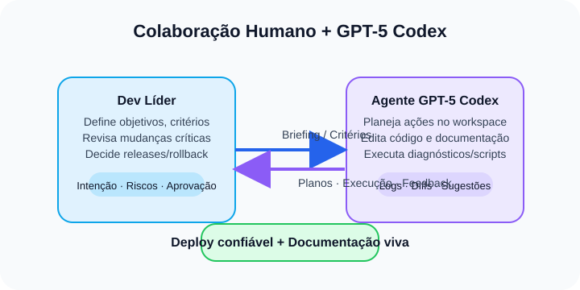

# Controle NCs: co-criando software com um agente GPT-5 Codex

> Como uma equipe humana integrou um agente de IA ao fluxo completo de engenharia — da auditoria ao deploy em produção — mantendo segurança, rastreabilidade e documentação viva.

## 1. Por que experimentar uma colaboração radical dev + IA?
O app **Controle NCs** nasceu para apoiar equipes de campo na gestão de territórios e notificações de contato. A motivação deste estudo foi ir além do uso pontual de sugestões de código: queríamos entender o que acontece quando um agente de IA assume participação ativa em todo o ciclo de vida do software, trabalhando ombro a ombro no VS Code. O público-alvo são engenheiros de software e líderes técnicos interessados em produtividade assistida com governança.

## 2. Diagnóstico inicial: dores reais em um projeto vivo
Antes da intervenção, identificamos três frentes críticas:
- Deploy GitHub Pages falhando por conflitos entre workflows e assets desatualizados.
- Fluxo de autenticação com PAT exposto a riscos (armazenamento permanente e falta de governança).
- Documentação fragmentada, dificultando onboarding e auditabilidade.

Esse mapeamento foi conduzido com o agente GPT-5 Codex já acessando o repositório: ele listou arquivos, analisou workflows e sugeriu hipóteses que validamos juntos. A conversa era registrada diretamente no editor, preservando rastro das decisões.

## 3. Setup da parceria humana + IA
- **Ferramentas:** VS Code rodando GPT-5 Codex como agente operacional, PowerShell para comandos, GitHub como origem única da verdade.
- **Regras de colaboração:** humano define objetivos e valida cada etapa crítica; agente executa rotinas (git, npm, edições) e explica riscos antes de alterar algo sensível.
- **Segurança do PAT:** criação de tokens fine-grained, ofuscação automatizada via `scripts/publish-token.mjs`, validação manual com `npm run validate:token`.
- **Intervenção manual única:** precisei autenticar uma vez na conta Microsoft; todo o restante foi conduzido pelo agente sob minha supervisão.

Esse acordo operacional evitou a “caixa-preta” comum em assistentes autônomos: o agente sempre justificava decisões e aguardava confirmação antes de tocar em recursos críticos.

## 4. Linha do tempo resumida
1. **Auditoria**: inspeção do repositório React/Vite, verificação do `data/db.yml` (fonte única) e revisão dos workflows GitHub Actions.
2. **Correção do deploy**: remoção do workflow conflituoso, ajuste do `pages.yml` e validação do build local (`npm run build` + `npm run preview`).
3. **Fortalecimento do fluxo PAT**: feedback visual no front-end, mensagens de responsabilidade e armazenamento temporário do token.
4. **Testes end-to-end**: retomada do Playwright para garantir login e carregamento do YAML, com execução via `npx playwright test`.
5. **Documentação viva**: consolidação de guias em `docs_export/`, criação do checklist de CI/CD e FAQ operacional.
6. **Entrega multimídia**: diagrama UML mantido em PlantUML + PNG/PDF, vídeo demonstrativo hospedado em GitHub Releases para evitar binários no Git.

Cada marco foi registrado pelo agente, com logs de comandos e arquivos modificados, permitindo auditoria posterior.

## 5. Arquitetura e fluxo técnico
- 

	> A liderança humana define critérios e aprova cada etapa; o agente documenta planos, aplica mudanças e mantém logs e diffs para auditoria.

- **Front-end:** React + Vite + Tailwind CSS, compondo uma SPA servida pelo GitHub Pages.
- **Persistência:** `data/db.yml` versionado; a aplicação consome e grava via GitHub REST API utilizando o PAT informado pelo operador.
- **Serviços auxiliares:** `GithubService` (fetch/update base64), `TokenManager` (fragmentação/reconstrução do PAT) e `YamlRepository` (parse + patches do YAML). O [diagrama UML](./Controle_NCs_Classes.png) detalha essas relações.
- **Automação:** workflow `.github/workflows/pages.yml` faz install → build → deploy. Nenhum pipeline extra é necessário.
- **Testes:** Playwright em Chromium; futuros cenários incluirão mutações de YAML e rollback.

A decisão-chave aqui foi manter o repositório como fonte única: nada de bancos externos nem secrets persistentes fora do GitHub.

## 6. Como a IA interveio no código e na documentação
- **Diagnóstico acelerado:** o agente mapeou rotas quebradas (erros 404) e sugeriu hotfixes.
- **Edições guiadas:** sempre que alterava arquivos críticos (`AppControleNcs.tsx`, workflows), explicava o diff e gatilhos de rollback (`git revert`, releases anteriores).
- **Documentação unificada:** reorganizou o material em `docs_export/`, criou o novo `README.md` e manteve alinhamento entre guias individuais e o compêndio completo.
- **Transparência:** cada comando `git`, `npm` ou script era documentado no chat, formando uma linha do tempo verificável.

O humano continua responsável por aceitar/rejeitar propostas, mas o agente reduz drasticamente o tempo entre diagnóstico e entrega.

## 7. Resultados observados
- Deploy estável no GitHub Pages com build reprodutível.
- Token ofuscado renovável em minutos, com checklist de segurança claro.
- Testes Playwright rodando no pipeline local, prontos para serem plugados na CI.
- Documentação consolidada em um único diretório, com leitura modular (guias 01–08) ou narrativa completa (`documentacao-expositiva-completa.md`).
- Vídeo demonstrativo e diagramas mantidos fora da árvore Git principal (via Releases), evitando inflar o histórico.

## 8. Lições para equipes de engenharia
### Técnica
- Tratar a IA como par programador exige controles de versionamento e revisão humana intensos.
- Tokens e segredos continuam responsabilidade do time: scripts ajudam, mas é preciso governança.
- Manter dados em YAML versionado é viável, desde que haja testes que garantam integridade.

### Colaborativa
- O agente acelera tarefas trabalhosa (refatorar docs, revisar workflows), liberando o humano para decisões estratégicas.
- Transparência é vital: logs de todos os comandos e justificativas evitam “magia” e facilitam auditoria.
- Conversas curtas e objetivas reduzem mal-entendidos; cada intenção deve virar plano antes de execução.

## 9. Próximos passos
1. Ampliar a suíte Playwright cobrindo CRUD completo do YAML e fluxos de rollback.
2. Modularizar `AppControleNcs.tsx` para permitir contribuições paralelas.
3. Automatizar a checagem do token (checksum + validade) dentro do workflow `pages.yml`.
4. Avaliar GitHub Environments e secrets rotacionados para reduzir exposição a PATs pessoais.

## 10. Como reproduzir ou continuar a jornada
- Clone o repositório, execute `npm install` e rode `npm run dev` para ver o app.
- Utilize `docs_export/` como guia de referência rápida e `construindo-app-com-agente/construindo-app-com-agente.md` para mergulhar na narrativa completa.
- Acesse o vídeo de walkthrough em [GitHub Releases](https://github.com/EliezerRosa/app-controle-ncs/releases/latest/download/app-com-ia-para-a-dio.mp4).
- Consulte os prompts evolutivos em `docs_export/prompts/` para entender como moldamos a colaboração com o agente.

---

**Autor**: Moshe (time Controle NCs) em co-criação com o agente GPT-5 Codex.  
**Publicação original**: Outubro/2025.
